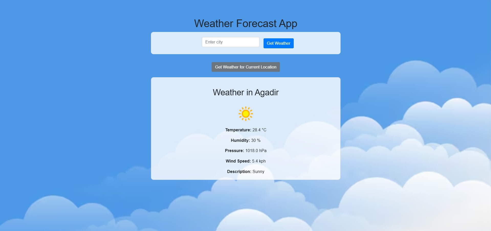

Thank you for the clarification! Here’s an updated `README.md` without Node.js references:

---

# Weather App 🌦️

Welcome to the **Weather App**! This application provides real-time weather information for any location you choose. Built with HTML, CSS, JavaScript, and Python, it’s simple and intuitive to use.

 <!-- Replace with actual screenshot link -->

## Features

- **Real-time Weather Data**: View current temperature, humidity, and conditions.
- **City-based Search**: Get weather data for any city around the world.
- **Weather Icon & Background Updates**: The app changes visuals based on the current weather condition.
- **Responsive Design**: Optimized for mobile and desktop viewing.

## Getting Started

### Prerequisites

- A web browser.
- Python installed on your system.

### Installation

1. **Clone the repository**:

   ```bash
   git clone https://github.com/ayoubmori/weather-app.git
   ```

2. **Navigate into the directory**:

   ```bash
   cd weather-app
   ```

3. **Get your API key**:
   - Sign up at [OpenWeather](https://openweathermap.org/) to get a free API key.
   - Replace `YOUR_API_KEY` in `app.py` with your OpenWeather API key.

4. **Run the app**:
   - Start the Python server by running:

     ```bash
     python app.py
     ```

   - Open `index.html` in your browser, or visit the specified local server address (usually `http://127.0.0.1:5000/`).

### Usage

- **Search**: Enter the name of any city and press "Search" to see the current weather.
- **Auto-Refresh**: The app refreshes the weather data every time you search.

## Technologies Used

- **HTML, CSS**: For app structure and styling.
- **JavaScript**: Handles minor interactions and dynamic updates.
- **Python (Flask)**: Powers the server-side and handles API requests.
- **OpenWeather API**: Provides the weather data.

## Contributing

Contributions are welcome! To contribute:

1. Fork the repository.
2. Create a new branch for your feature (`git checkout -b feature-branch`).
3. Commit your changes (`git commit -m 'Add some feature'`).
4. Push to the branch (`git push origin feature-branch`).
5. Open a pull request.

